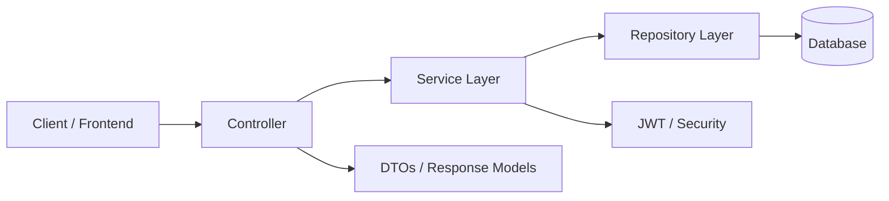
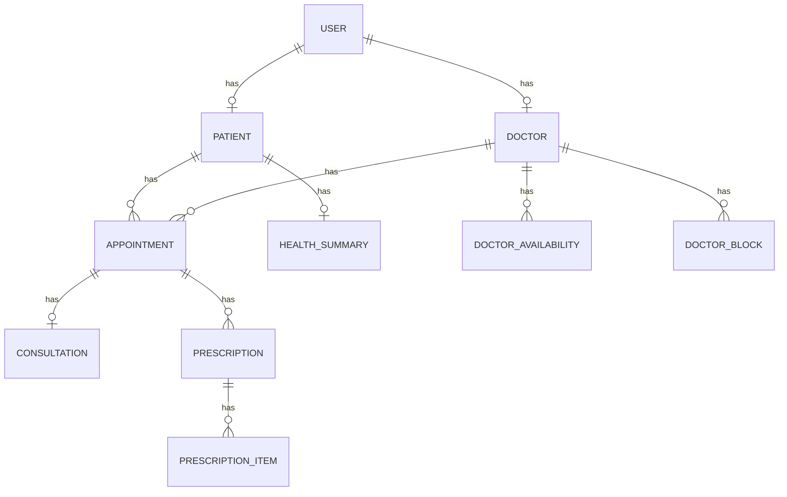
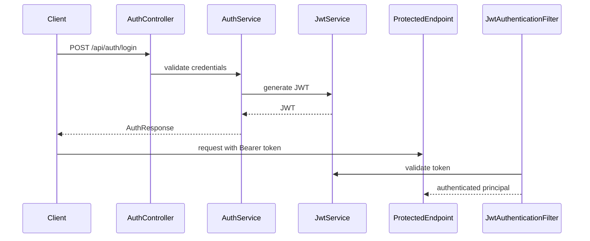
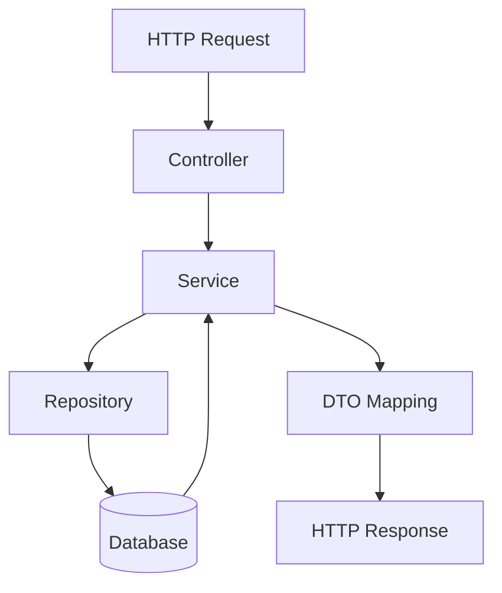

# MediConnect Backend

A Spring Boot backend for a healthcare appointment and electronic health record workflow. The project currently supports user registration/login, doctor and patient profile management, doctor scheduling, appointment booking, consultation creation, prescription creation, and admin oversight.

> This README documents the features and structure that are present in the current codebase. Anything not found in the source is explicitly marked as “Not implemented”.

## Overview

MediConnect Backend is a layered Spring Boot application built with Spring MVC, Spring Data JPA, Spring Security, JWT authentication, Redis configuration, and OpenAPI/Swagger documentation. The current implementation focuses on core clinical workflow operations rather than a full production-grade healthcare platform.

## Implemented Features

- User registration and login with JWT-based authentication
- Role-based access control for PATIENT, DOCTOR, and ADMIN users
- Doctor profile creation, update, deletion, and search
- Doctor recurring availability and blocked-slot management
- Doctor availability calendar and date-based slot generation
- Patient profile creation, update, deletion, and lookup
- Appointment booking, retrieval, and cancellation
- Consultation record creation
- Prescription creation with medication items
- Health summary updates for patients
- Admin endpoints for listing users, doctors, patients, and appointments
- Swagger/OpenAPI documentation support

## Tech Stack

| Layer | Technology |
|---|---|
| Framework | Spring Boot 3.3.3 |
| Language | Java 21 |
| Web | Spring Web MVC |
| Data | Spring Data JPA |
| Security | Spring Security + JWT (jjwt) |
| Database | H2 (default), PostgreSQL, MySQL support |
| Cache/Session Store | Redis |
| Validation | Spring Validation |
| Documentation | springdoc-openapi + Swagger UI |
| Build | Maven |
| Testing | JUnit 5, Spring Boot Test |

## Architecture Overview

The application follows a standard layered architecture:

- Controllers handle HTTP requests and responses
- Services contain business logic and transaction boundaries
- Repositories provide persistence access through Spring Data JPA
- Entities represent database tables
- DTOs isolate API payloads from persistence entities
- Security filters and JWT services enforce authentication and authorization



## Package Structure and Purpose

| Package | Purpose |
|---|---|
| com.MediConnect.App.controller | REST endpoints for auth, doctors, patients, appointments, consultations, prescriptions, admin, and health checks |
| com.MediConnect.App.service | Business logic for authentication, scheduling, appointments, profiles, and admin operations |
| com.MediConnect.App.repository | Spring Data JPA repositories for persistence access |
| com.MediConnect.App.entity | JPA entities and base persistence model |
| com.MediConnect.App.dto.request | Request payload classes |
| com.MediConnect.App.dto.response | Response payload classes |
| com.MediConnect.App.mapper | DTO/entity mapping helpers |
| com.MediConnect.App.security | JWT generation, JWT filter, and Spring Security configuration |
| com.MediConnect.App.config | Redis and OpenAPI configuration |
| com.MediConnect.App.exception | Custom exception and global error handling |
| com.MediConnect.App.enums | Enum definitions such as roles, appointment state, and medical enums |

## Project Tree

```text
mediconnect-backend/
├── src/
│   ├── main/
│   │   ├── java/
│   │   │   └── com/MediConnect/App/
│   │   │       ├── config/
│   │   │       ├── controller/
│   │   │       ├── dto/
│   │   │       ├── entity/
│   │   │       ├── enums/
│   │   │       ├── exception/
│   │   │       ├── mapper/
│   │   │       ├── repository/
│   │   │       ├── security/
│   │   │       └── service/
│   │   └── resources/
│   │       ├── application.properties
│   │       ├── application-postgres.properties
│   │       └── application-docker.properties
│   └── test/
│       └── java/com/MediConnect/App/
├── pom.xml
└── README.md
```

## Database Design

The persistence layer is built around JPA entities with a shared base entity for common audit fields.

### Main entities

- User: authentication and identity record
- Doctor: doctor profile linked to one user
- Patient: patient profile linked to one user
- Appointment: booked consultation slot linked to one doctor and one patient
- Consultation: consultation note attached to one appointment
- Prescription: prescription attached to an appointment
- PrescriptionItem: line item inside a prescription
- HealthSummary: patient medical summary
- DoctorAvailability: recurring doctor availability slots
- DoctorBlock: blocked periods for a doctor
- RefreshToken: refresh tokens issued during login

### Entity Relationship Overview



## Authentication and Authorization Flow

Authentication is implemented with Spring Security and JWT.

1. A client calls the authentication endpoints under /api/auth.
2. The AuthService validates credentials and issues a JWT.
3. The JwtAuthenticationFilter reads the Bearer token from the Authorization header.
4. The SecurityConfig enforces role-based access rules for protected endpoints.



## API Modules

| Module | Base Path | Summary |
|---|---|---|
| Auth | /api/auth | Register and login |
| Doctor | /api/doctors | Search doctors, manage profiles, availability, blocks, and slots |
| Patient | /api/patients | Create/update/delete patient profile |
| Appointment | /api/appointments | Book, list, and cancel appointments |
| Consultation | /api/consultations | Create consultation records |
| Prescription | /api/prescriptions | Create prescriptions |
| Health Summary | /api/health-summary | Update patient health summary |
| Admin | /api/admin | View users, doctors, patients, appointments, and update roles |
| Health | /actuator/health | Simple health endpoint |

## Request Flow / Application Workflow



Typical booking flow:

1. A patient calls the appointment booking endpoint.
2. The service validates the doctor, slot, and booking conflicts.
3. The appointment is written to the database.
4. The response returns the booking details.

## Configuration

The application uses Spring Boot property files for environment-specific configuration.

### Main files

- application.properties: default local configuration using H2 in-memory database
- application-postgres.properties: PostgreSQL configuration
- application-docker.properties: Docker-oriented PostgreSQL configuration

### Key properties

| Property | Purpose |
|---|---|
| spring.datasource.url | Database JDBC URL |
| spring.jpa.hibernate.ddl-auto | Hibernate schema update behavior |
| spring.data.redis.host / port | Redis connection settings |
| jwt.secret / jwt.expiration-ms | JWT signing and expiration |
| server.port | Application port |

## Prerequisites

- Java 21
- Maven 3.9+
- Redis (for the configured Redis setup)
- A supported database: H2 by default, PostgreSQL, or MySQL

## Installation and Setup

### 1. Clone the repository

```bash
git clone <repository-url>
cd mediconnect-backend
```

### 2. Build the project

```bash
./mvnw clean package
```

On Windows:

```powershell
mvnw.cmd clean package
```

### 3. Run the application

```bash
./mvnw spring-boot:run
```

On Windows:

```powershell
mvnw.cmd spring-boot:run
```

The application will start on port 8080 by default.

## Database Setup

### Default local setup

The default configuration uses an in-memory H2 database.

- JDBC URL: jdbc:h2:mem:mediconnectdb
- Username: sa
- Password: raghu
- H2 Console: /h2-console

### PostgreSQL setup

Use the profile or environment variables to switch to PostgreSQL:

```bash
SPRING_PROFILES_ACTIVE=postgres ./mvnw spring-boot:run
```

## Environment Variables

| Variable | Default | Purpose |
|---|---|---|
| REDIS_HOST | localhost | Redis host |
| REDIS_PORT | 6379 | Redis port |
| REDIS_PASSWORD | empty | Redis password |
| JWT_SECRET | change-me-in-productions | JWT signing secret |
| JWT_EXPIRATION_MS | 86400000 | JWT expiration in milliseconds |
| PORT | 8080 | Server port |
| DB_URL | jdbc:postgresql://localhost:5432/mediconnect | PostgreSQL URL |
| DB_USERNAME | mediconnect | PostgreSQL username |
| DB_PASSWORD | mediconnect | PostgreSQL password |

## API Documentation (Swagger)

Swagger UI is available when the application is running:

- Swagger UI: http://localhost:8080/swagger-ui/index.html
- OpenAPI JSON: http://localhost:8080/v3/api-docs

The API documentation is configured through springdoc-openapi and the OpenAPI configuration class in the project.

## Error Handling

The application uses a global exception handler to return consistent JSON error responses for common failures such as:

- invalid role input
- bad credentials
- invalid appointment or doctor state
- missing resources
- unexpected server errors

## Validation

Validation in the current codebase is implemented through a mix of:

- entity-level constraints such as @NotBlank, @Email, @Pattern, and @Min
- service-side validation for scheduling and business rules
- request-body validation on authentication endpoints

No extensive request DTO bean-validation annotations are currently present beyond the authentication flow.

## Security Features

Implemented security features include:

- Stateless JWT-based authentication
- Role-based authorization based on user role
- BCrypt password hashing
- CSRF disabled for API usage
- Protected endpoints defined in SecurityConfig

## Important Design Decisions

- A shared BaseEntity centralizes common persistence fields and lifecycle hooks.
- A service layer keeps controllers thin and business logic testable.
- Repository methods use custom queries for schedule conflict and slot lookup logic.
- Pessimistic locking is used for doctor and appointment booking operations to reduce race conditions.
- DTOs are used to decouple API contracts from persistence entities.

## Sample API Requests

### Register user

```json
POST /api/auth/register
{
  "name": "Alice",
  "email": "alice@example.com",
  "password": "secret123",
  "phone": "9876543210",
  "role": "PATIENT"
}
```

### Book appointment

```json
POST /api/appointments/book
{
  "patientId": 1,
  "doctorId": 2,
  "startAt": "2026-07-10T10:30:00"
}
```

## Future Improvements

The following are not currently implemented in the codebase and are reasonable next steps:

- Email/SMS notifications for appointments and prescriptions
- Payment integration
- Full patient medical record history beyond the current entities
- Pagination and filtering for list endpoints
- Unit and integration tests beyond the existing context-load smoke test
- Advanced audit logging and soft-delete workflows

## Learning Outcomes

This project demonstrates:

- Spring Boot REST API design
- Spring Data JPA entity modeling
- JWT-based security implementation
- Role-based authorization
- Transaction management in service layer
- API documentation with Swagger/OpenAPI
- Redis configuration in a Spring Boot application

## Contributing

Contributions are welcome. Please open an issue or submit a pull request with a clear explanation of the change.

## License

This project is licensed under the MIT License.

## Author

- Name: Your Name
- Email: your.email@example.com
- GitHub: your-github-username
